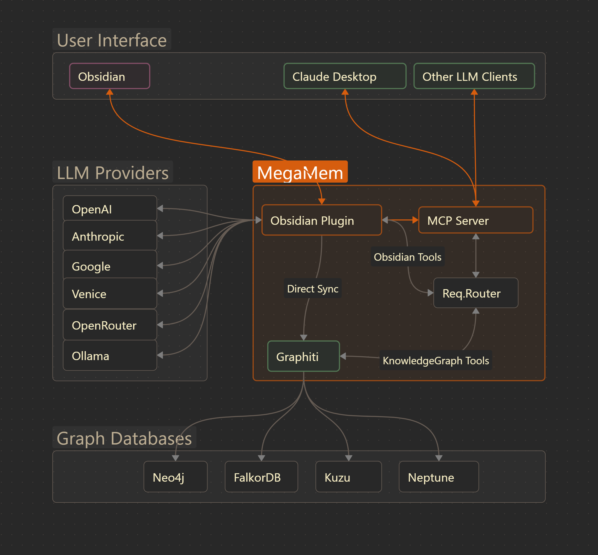

# MegaMem

> These docs were written in about 30min with MegaMem, sourcing over 120 development docs loaded into the graph [love GraphRAG]. **_Aside, I haven't read it all—their may be a few mistakes...that shall be corrected as time permits._**

MegaMem is an advanced Obsidian plugin that bridges your personal knowledge vault with AI-powered graph databases, creating a seamless ecosystem for knowledge discovery, semantic search, and intelligent content management. With native Claude Desktop integration and support for multiple LLM providers, MegaMem transforms how you interact with your life.

## Key Features

### Bi-directional Sync

- Real-time synchronization between Obsidian and graph databases
- Maintains data integrity across platforms
- Supports both Neo4j and FalkorDB backends

### AI-Powered Knowledge Extraction

- Intelligent entity recognition and relationship mapping
- Support for multiple LLM providers (OpenAI, Anthropic, Ollama, OpenRouter)
- Custom ontology support for domain-specific knowledge modeling

### Semantic Search

- Vector-based similarity search across your entire vault
- AI-enhanced query understanding
- Contextual result ranking and relevance scoring

### Multi-Database Support

- **Neo4j**: Industry-standard graph database for complex relationships
- **FalkorDB**: High-performance in-memory graph database for speed
- **Kuzu**: Coming soon
- **Amazon Neptune**: Coming soon

### LLM Client Integration (ie. Claude Desktop)

- Native MCP (Model Context Protocol) server
- Direct access to vault content from LLM conversations
- Intelligent note creation and management through AI

### Custom Ontologies

- Define domain-specific entity types and relationships
- Flexible schema management
- Advanced knowledge modeling capabilities

## Quick Links

- [**5-Minute Setup Guide**](#quick-start-guide) - Get started immediately
- [**Plugin Settings**](#megamem-plugin-settings) - Complete configuration reference
- [**Development Roadmap**](#megamem-development-roadmap) - Upcoming features and timeline

## System Requirements

| Component    | Minimum Version             | Recommended   |
| ------------ | --------------------------- | ------------- |
| **Obsidian** | 1.10.1+                     | Latest stable |
| **Node.js**  | 18.0+                       | 20.0+         |
| **Python**   | 3.11+                       | 3.11+         |
| **Database** | Neo4j 5.0+ or FalkorDB 1.0+ | Latest stable |

## Architecture Overview



## Use Cases

### Research & Academia

- Build comprehensive knowledge graphs from research papers
- Track relationships between concepts, authors, and publications
- Generate literature reviews with AI assistance

### Professional Knowledge Management

- Organize project documentation with intelligent linking
- Create searchable repositories of institutional knowledge
- Enable team collaboration through shared graph insights

### Personal Knowledge Building

- Transform daily notes into interconnected insights
- Discover unexpected connections in your thinking
- Build a "second brain" with AI-enhanced recall

### Content Creation

- Research topics with semantic search capabilities
- Generate content outlines based on existing knowledge
- Maintain consistency across large writing projects

## Core Technologies

- **Graphiti** - Temporal Knowlede Graph Integration
- **TypeScript/JavaScript** - Plugin architecture and UI
- **Python** - AI/ML processing and graph operations
- **Svelte** - Modern reactive UI components
- **Graph Databases** - Knowledge storage and querying
- **Vector Embeddings** - Semantic search capabilities
- **MCP Protocol** - LLM Client Desktop integrations

## Community & Support

MegaMem is actively developed with a focus on user needs and community feedback. Whether you're a researcher, writer, or knowledge worker, MegaMem adapts to your workflow while providing powerful AI-enhanced capabilities.

---

**Ready to transform your knowledge management?** Start with our [Quick Start Guide](#quick-start-guide) and have MegaMem running in under 5 minutes.

---

# 🚀 Quick Start Guide

Get MegaMem running in your Obsidian vault in under 5 minutes with this streamlined setup process.

## 📦 Installation

### Method 1: Community Plugins (Coming Soon!)

1. **Open Obsidian Settings**

   - Go to `Settings` → `Community plugins`
   - Disable `Safe mode` if enabled

2. **Install MegaMem**
   - Click `Browse` and search for "MegaMem"
   - Click `Install` → `Enable`

### Method 2: Manual Installation

1. **Download Latest Release**

   - Visit https://github.com/C-Bjorn/megamem-mcp/releases
   - Download the latest release ZIP file
   - Extract the contents to your vault's `.obsidian/plugins/megamem-mcp/` directory

2. **Enable Plugin**
   - Restart Obsidian
   - Go to `Settings` → `Community plugins`
   - Enable "MegaMem MCP"

## ⚡ 6-Step Setup

### Step 1: Database Setup

Setup your preferred database (Neo4j or FalkorDB - see [Database Setup](#database-setup-guide) for details). **Kuzu & Amazon Neptune coming soon**

### Step 2: Python Dependencies

Under Python Environment (first accordion section), click "Install Dependencies".

### Step 3: LLM Configuration

In Plugin Settings, add your LLM keys and configuration (select "Load Defaults" to start)

### Step 4: Database Configuration

In Plugin Settings, enter the Database Configuration and click "Test Connection" and then "Initialize Schema"

**Installation Method:** The plugin now defaults to using the UV Package Manager, which is recommended for most users and provides better cross-platform compatibility (macOS, Windows, Linux). System Python is available for advanced users who prefer their own Python installation.

**Note:** If you encounter installation issues on macOS or Windows, the plugin uses platform-specific extraction methods to ensure proper setup. The installation process will handle tar.gz archives on macOS/Linux and zip archives on Windows automatically.

### Step 5: Basic Setup Complete

For basic functionality - leave everything else default.

### Step 6: Advanced Configuration (Optional)

For custom ontologies, set [Knowledge Namespacing](#knowledge-namespacing) settings, and review "Ontology Manager" section.

## 🤖 MCP Server Setup (for Claude Desktop and other private LLM consoles)

1. **Generate MCP Configuration**

   - Go to Plugin Settings → Servers section
   - Click "Generate Config" button
   - Copy the generated configuration (formatted with `mcpServers` wrapper for Claude Desktop compatibility)

2. **Apply to Your MCP Client**
   - For Claude Desktop: Paste the configuration into your `claude_desktop_config.json` file
   - For other MCP clients: Use the configuration as directed by your client's documentation
   - Restart your MCP client
   - Verify connection in chat interface

## ✅ Verification Checklist

- [ ] Database connection successful
- [ ] LLM provider responding correctly
- [ ] Python dependencies installed
- [ ] Plugin enabled and configured
- [ ] Claude Desktop MCP connection active

---

**🎉 Congratulations!** MegaMem is now transforming your Obsidian vault into an intelligent knowledge graph. Explore the [Plugin Settings](#megamem-plugin-settings) to unlock advanced features.

---

# MegaMem Plugin Settings

This document provides a comprehensive overview of all available settings in the MegaMem plugin. Settings are organized into logical sections for easy navigation.

## API Keys

Configure API keys for various AI service providers.

### OpenAI API Key <i data-lucide="check-circle"></i>

- Description: API key for OpenAI services
- Developer Note: Required for OpenAI LLM and embedding models. Fully implemented and tested.

### Anthropic API Key <i data-lucide="check-circle"></i>

- Description: API key for Anthropic services
- Developer Note: Required for Claude models. Fully implemented and tested.

### Google API Key <i data-lucide="check-circle"></i>

- Description: API key for Google services
- Developer Note: Required for Gemini models and Google embeddings. Fully implemented and tested.

### Azure OpenAI API Key <i data-lucide="check-circle"></i>

- Description: API key for Azure OpenAI services
- Developer Note: Required for Azure-hosted OpenAI models. Fully implemented and tested.

### Voyage AI API Key <i data-lucide="check-circle"></i>

- Description: API key for Voyage AI services
- Developer Note: Required for Voyage embedding models. Fully implemented and tested.

### Venice.ai API Key <i data-lucide="alert-triangle"></i>

- Description: API key for Venice.ai services
- Developer Note: Basic API connection implemented but not fully supported yet. Use with caution.

### OpenRouter API Key <i data-lucide="check-circle"></i>

- Description: API key for OpenRouter services
- Developer Note: Required for OpenRouter models and presets. Fully implemented and tested.

### Ollama - Fully Private Local Models <i data-lucide="alert-triangle"></i>

- Description: Run AI models locally on your machine without sending data to external services
- Developer Note: NOT fully working - pending development to support JSON schema for custom entities (works ok with generic entities). Complete local model management with installation, status checking, and model downloads.

#### Actions:

- **Install Ollama** <i data-lucide="download"></i>: Downloads and installs Ollama on your system
- **Refresh Status** <i data-lucide="refresh-cw"></i>: Checks Ollama installation status and available models

### Validate All API Keys <i data-lucide="check-circle"></i>

#### Actions:

- **Validate API Keys** <i data-lucide="shield-check"></i>: Validates all configured API keys without testing models

## LLM Configuration

Configure language model providers and specific models.

### LLM Defaults

#### Actions:

- **Load Defaults** <i data-lucide="download"></i>: Merge recommended defaults into your current settings without overwriting custom entries

### LLM Provider <i data-lucide="check-circle"></i>

- Description: Choose your language model provider
- Options: OpenAI, Anthropic, Google AI, Azure OpenAI, Ollama (Local), Venice.ai, OpenRouter
- Developer Note: All providers implemented with proper model selection and testing.

### LLM Model <i data-lucide="check-circle"></i>

- Description: Primary language model for processing
- Developer Note: Dynamic model loading from provider-specific defaults. Supports custom models for Ollama.

### LLM Model Small <i data-lucide="check-circle"></i>

- Description: Smaller, faster model for re-ranking operations (optional)
- Developer Note: Used for performance optimization in re-ranking scenarios.

### OpenRouter Preset Slug <i data-lucide="check-circle"></i>

- Description: OpenRouter preset name to use (leave empty to disable preset usage)
- Developer Note: Allows using OpenRouter presets for model management.

#### Actions:

- **Add Default** <i data-lucide="plus"></i>: Add preset model to dropdowns

### Use Preset with Custom Model <i data-lucide="check-circle"></i>

- Description: When enabled, append preset to custom OpenRouter models
- Developer Note: Combines custom models with preset configurations.

### LLM Connection Testing

#### Actions:

- **Test LLM Connection** <i data-lucide="zap"></i>: Test your language model provider configuration

### Embedding Provider <i data-lucide="check-circle"></i>

- Description: Choose your embedding provider
- Options: OpenAI, Google AI, Voyage AI, Ollama (Local)
- Developer Note: All providers implemented with automatic vault registry updates. **IMPORTANT**: Each database can only support one embedder config. If you change it later - all things will break. _In the future, MegaMem plans to support multiple databases with multiple configs._

### Embedding Model <i data-lucide="check-circle"></i>

- Description: Model for generating embeddings
- Developer Note: Includes embedding model change detection and database conflict warnings.

### Custom LLM Model (Ollama only) <i data-lucide="check-circle"></i>

- Description: Download any Ollama LLM model by name (e.g., llama3.2:3b, codellama:13b)

#### Actions:

- **Download** <i data-lucide="download"></i>: Download this model from Ollama registry

### Custom Embedding Model (Ollama only) <i data-lucide="check-circle"></i>

- Description: Download any Ollama embedding model by name (e.g., nomic-embed-text, mxbai-embed-large)

#### Actions:

- **Download** <i data-lucide="download"></i>: Download this embedding model from Ollama registry

### Embedding Connection Testing

#### Actions:

- **Test Embedding** <i data-lucide="activity"></i>: Test your embedding provider configuration

### Cross-Encoder Provider <i data-lucide="check-circle"></i>

- Description: Choose your cross-encoder/reranker provider for improved search ranking
- Options: None - Disable reranking, OpenAI Reranker, BGE Reranker (Local), Gemini Reranker
- Developer Note: Improves search result quality through reranking. Currently the only fully Private Cross-Encoder is "BGE Reranker" (from huggingface) which is not configurable. _In the future, MegaMem will support selecting multiple models. Also, this can add a lot of time to each sync, so we recommend enabling "Experimental Daemon Mode" in Development Options when running BGE._

### Cross-Encoder Model <i data-lucide="check-circle"></i>

- Description: Specific model for cross-encoding/reranking operations
- Developer Note: Conditionally visible based on provider selection.

### Provider Testing

#### Actions:

- **Test Full Pipeline** <i data-lucide="cpu"></i>: Test that your LLM and embedding providers work together correctly with full pipeline testing

### Daemon Management (when enabled)

#### Actions:

- **Reload Sync Daemon** <i data-lucide="rotate-cw"></i>: Restart the sync daemon to apply new provider configuration
- Developer Note: When Daemon is enabled, be sure to click this anytime you change your LLM settings.

## Database Configuration

Configure your graph database backend.

### Database Type <i data-lucide="check-circle"></i>

- Description: Choose your graph database backend
- Options: Neo4j, FalkorDB
- Developer Note: Neo4j fully tested with latest. FalkorDB - not tested in a while, proceed with caution.

### Neo4j URI <i data-lucide="check-circle"></i>

- Description: Neo4j connection URI (e.g., bolt://localhost:7687)
- Developer Note: Standard Neo4j bolt protocol connection.

### Neo4j Username <i data-lucide="check-circle"></i>

- Description: Neo4j database username
- Developer Note: Authentication for Neo4j database access.

### Neo4j Password <i data-lucide="check-circle"></i>

- Description: Neo4j database password
- Developer Note: Secure password field for Neo4j authentication.

### Neo4j Database Name <i data-lucide="check-circle"></i>

- Description: Name of the Neo4j database to use
- Developer Note: Use the default: "neo4j". Currently there is a bug in graphiti wherein custom db names break things.

### FalkorDB Host <i data-lucide="check-circle"></i>

- Description: FalkorDB host address
- Developer Note: Redis-compatible FalkorDB connection.

### FalkorDB Port <i data-lucide="check-circle"></i>

- Description: FalkorDB port number
- Developer Note: Configurable port with validation (1-65535).

### FalkorDB Username (Optional) <i data-lucide="check-circle"></i>

- Description: FalkorDB username (leave empty if not using authentication)
- Developer Note: Optional authentication for secured FalkorDB instances.

### FalkorDB Password (Optional) <i data-lucide="check-circle"></i>

- Description: FalkorDB password (leave empty if not using authentication)
- Developer Note: Optional secure password field.

### FalkorDB Database Name <i data-lucide="check-circle"></i>

- Description: Name of the FalkorDB database to use
- Developer Note: Database name configuration for FalkorDB.

### Database Testing and Setup

#### Actions:

- **Test Connection** <i data-lucide="database"></i>: Verify your database connection settings
- **Initialize Schema** <i data-lucide="table"></i>: Set up the required Graphiti schema in your database (run this after successful connection test)

## Python Environment

**IMPORTANT**: This section appears first in the plugin settings. Python dependencies must be installed before anything will work properly.

### Python Path (Optional) <i data-lucide="check-circle"></i>

- Description: Specify custom Python executable path (leave empty for auto-detection)
- Developer Note: Allows custom Python interpreter specification.

### Python Dependency Management

**Installation Methods:**

- **UV Package Manager (Recommended)**: Default installation method with better cross-platform compatibility for macOS, Windows, and Linux. Handles platform-specific archive formats automatically.
- **System Python**: For advanced users who prefer to use their own Python installation.

#### Actions:

- **Check Dependencies** <i data-lucide="search"></i>: Check if Graphiti Python dependencies are installed
- **Install Dependencies** <i data-lucide="package-plus"></i>: Install Graphiti and required Python packages. The default UV method downloads the uv package manager and uses it to create an isolated Python environment with all required dependencies.

## Sync Configuration <i data-lucide="alert-triangle"></i>

Configure automatic synchronization behavior. **WARNING**: This works, but we HIGHLY RECOMMEND NOT USING IT. It is not thoroughly tested, conflicts may arise between Included & Excluded folders and time intervals. Much work remains to be done.

### Automatically sync notes at scheduled intervals <i data-lucide="clock"></i>

- Description: Automatically sync notes when they are saved or at regular intervals
- Developer Note: Enhanced UI complete, sync engine needs update.

### Sync Options <i data-lucide="clock"></i>

- Description: Choose which notes to include in automatic sync operations
- Options: New notes only, New and updated notes
- Developer Note: UI implementation complete.

### Sync Interval <i data-lucide="clock"></i>

- Description: Automatic sync interval in minutes (0 to disable)
- Developer Note: UI complete, sync engine not implemented.

### Included Folders <i data-lucide="check-circle"></i>

- Description: Folders to include in sync. Leave empty to include all folders.
- Developer Note: Dynamic folder management with FolderSuggest integration.

#### Actions:

- **Add Folder** <i data-lucide="folder-plus"></i>: Add a new folder to include in sync
- **Delete** <i data-lucide="x"></i>: Remove folder from inclusion list (per folder)

### Excluded Folders <i data-lucide="check-circle"></i>

- Description: Folders to exclude from sync (e.g., .obsidian, .trash).
- Developer Note: Dynamic folder exclusion management.

#### Actions:

- **Add Folder** <i data-lucide="folder-plus"></i>: Add a new folder to exclude from sync
- **Delete** <i data-lucide="x"></i>: Remove folder from exclusion list (per folder)

### Globally Ignored Fields <i data-lucide="check-circle"></i>

- Description: YAML frontmatter fields to ignore globally across all notes.
- Developer Note: Prevents specific frontmatter fields from being synced.

#### Actions:

- **Add Field** <i data-lucide="plus"></i>: Add a new field to ignore globally
- **Delete** <i data-lucide="x"></i>: Remove field from ignore list (per field)

## Knowledge Namespacing

Configure how knowledge is organized in the graph database.

### Use Custom Ontology <i data-lucide="check-circle"></i>

- Description: Enable custom entity types with pre-existing Pydantic models. When disabled, uses generic text episodes.
- Developer Note: Controls entity type customization level.

### Namespace Strategy <i data-lucide="check-circle"></i>

- Description: Primary strategy for organizing knowledge in the graph
- Options: Vault Name, Folder Path, Property Value, Custom Value
- Developer Note: Intelligent preset controller for namespace organization.

### Default Namespace <i data-lucide="check-circle"></i>

- Description: Default namespace when strategy is "custom" or when other strategies fail
- Developer Note: Fallback namespace configuration.

### Enable Folder Namespacing <i data-lucide="check-circle"></i>

- Description: Use top-level folder names as namespaces. Subfolders are not supported.
- Developer Note: Top-level folder-based namespace generation.

### Custom Folder Mappings <i data-lucide="check-circle"></i>

- Description: Map specific folders to custom group_id namespaces. Leave empty to use automatic folder names.
- Developer Note: Advanced folder-to-namespace mapping with auto-population.

#### Actions:

- **Add Folder Mapping** <i data-lucide="folder-plus"></i>: Add a new folder-to-namespace mapping
- **Delete** <i data-lucide="x"></i>: Remove folder mapping (per mapping)

### Enable Property Namespacing <i data-lucide="check-circle"></i>

- Description: Use g_group_id frontmatter property as namespace when available
- Developer Note: Property-based namespace detection.

### Namespace Discovery

#### Actions:

- **Generate** <i data-lucide="refresh-cw"></i>: Scan the vault and generate the list of available namespaces based on the settings above

### Enable Multi-Vault Mode <i data-lucide="wrench"></i>

- Description: Enable advanced features for managing multiple Obsidian vaults
- Developer Note: Multi-vault features planned for future release.

### Current Vault Priority <i data-lucide="wrench"></i>

- Description: Priority level for this vault in multi-vault scenarios (higher numbers = higher priority)
- Developer Note: Multi-vault priority management (planned feature).

### Vault Configurations <i data-lucide="wrench"></i>

- Description: Currently tracking vault configurations
- Developer Note: Multi-vault management features planned for future release.

#### Actions:

- **Manage Vaults** <i data-lucide="settings"></i>: Manage vault configurations (disabled - planned feature)

## Servers

WebSocket and MCP server configuration.

### WebSocket Port <i data-lucide="check-circle"></i>

- Description: Port number for the shared WebSocket server (configured via MCP)
- Developer Note: Managed automatically by MCP processes.

### Authentication Token <i data-lucide="check-circle"></i>

- Description: Authentication token for secure WebSocket connections (managed by MCP)
- Developer Note: Auto-generated secure token for WebSocket authentication.

#### Actions:

- **Copy** <i data-lucide="copy"></i>: Copy authentication token to clipboard

### MCP Configuration

#### Actions:

- **Generate Config** <i data-lucide="file-text"></i>: Generate configuration for MCP clients to connect to the MCP server

## Advanced Settings <i data-lucide="settings"></i>

Advanced configuration options for debugging and performance. Many of the settings here are under development, use at your own risk.

### Debug Logging <i data-lucide="check-circle"></i>

- Description: Enable detailed logging for troubleshooting
- Developer Note: Comprehensive debug logging system with immediate state updates. Debug logging is less verbose by default to reduce log file size.

### Log Management

#### Actions:

- **View Logs** <i data-lucide="file-text"></i>: Open the plugin logs directory

### Manual Testing

#### Actions:

- **Select and Sync Note** <i data-lucide="file-plus"></i>: Sync a single note manually to test the connection and process

### Performance Metrics <i data-lucide="wrench"></i>

- Description: Track and display performance metrics
- Developer Note: Metrics collection not implemented.

### Max Retry Attempts <i data-lucide="check-circle"></i>

- Description: Maximum number of retry attempts for failed operations
- Developer Note: Configurable retry logic for robust operation.

### Connection Timeout <i data-lucide="check-circle"></i>

- Description: Connection timeout in seconds
- Developer Note: Configurable timeout for all connection operations.

### Auto-discover Schemas <i data-lucide="wrench"></i>

- Description: Automatically scan vault for schema patterns
- Developer Note: Schema discovery not implemented.

### Validate Naming Conventions <i data-lucide="wrench"></i>

- Description: Check property names against Graphiti best practices
- Developer Note: Validation not implemented.

### Suggest Property Descriptions <i data-lucide="wrench"></i>

- Description: Auto-generate descriptions for common property names
- Developer Note: AI suggestions not implemented.

### Protected Attribute Warnings <i data-lucide="wrench"></i>

- Description: Show warnings for Graphiti protected attribute names
- Developer Note: Warning system not implemented.

### Show Sync Status <i data-lucide="clock"></i>

- Description: Display sync status in the status bar
- Developer Note: UI setting complete, status bar integration not implemented.

### Show Notifications <i data-lucide="clock"></i>

- Description: Display notifications for sync operations
- Developer Note: UI setting complete, sync notifications not implemented.

### Compact Mode <i data-lucide="wrench"></i>

- Description: Use compact UI layout to save space
- Developer Note: Compact UI styling not implemented.

## Actions

Plugin configuration management.

#### Actions:

- **Export Settings** <i data-lucide="download"></i>: Export your current settings to a file
- **Import Settings** <i data-lucide="upload"></i>: Import settings from a file
- **Reset to Defaults** <i data-lucide="rotate-ccw"></i>: Reset all settings to their default values

## Development Options

Experimental features and development tools.

### Show Development Indicators <i data-lucide="check-circle"></i>

- Description: Display visual indicators showing which features are implemented vs. placeholder/TODO
- Developer Note: Visual development status indicators throughout the UI.

### Experimental Daemon Mode <i data-lucide="check-circle"></i>

- Description: Use persistent Python daemon to eliminate BGE model loading overhead (reduces sync time by ~60%)
- Developer Note: Significant performance improvement for sync operations.

### Load Daemon on Launch <i data-lucide="check-circle"></i>

- Description: Start Python daemon when plugin loads to eliminate first-sync delay (requires Experimental Daemon Mode)
- Developer Note: Preloads daemon for immediate sync availability.

### Log Performance <i data-lucide="check-circle"></i>

- Description: Enable detailed timing analysis for sync performance debugging
- Developer Note: Comprehensive performance timing and analysis.

## Status Legend

- <i data-lucide="check-circle"></i> Implemented: Feature is fully functional and tested
- <i data-lucide="clock"></i> Partial: UI complete but backend implementation pending
- <i data-lucide="alert-triangle"></i> Under Development: Basic functionality but not fully supported
- <i data-lucide="wrench"></i> Todo: Planned feature not yet implemented

## Provider-Specific Settings

Additional settings that appear based on your provider selection:

### Azure OpenAI Settings

- Azure Endpoint: Your Azure OpenAI endpoint URL
- Azure API Version: Azure OpenAI API version

### Ollama Settings

- Ollama Base URL: Ollama server base URL (used for both LLM and embedding)
- Ollama Embedding Dimension: Dimension size for Ollama embeddings (typically 768)

---

# MCP Commands Reference

This document lists all 19 available commands (tools) provided by the MegaMem MCP server: 10 MegaMem Graph Operations and 9 Obsidian WebSocket File Operations. Each command includes its description, parameters, and aliases, allowing for seamless interaction with the MegaMem knowledge graph and Obsidian vault.

> **Developer's Note:** You—the large language model accessing this documentation—don't necessarily need to "read" this in the traditional sense; your internal mechanisms often handle tool schema parsing automatically. This detailed reference is primarily for human developers, providing a comprehensive overview for understanding, debugging, and advanced usage. It also serves to illustrate the robust, fine-grained control MegaMem offers, showcasing its capabilities where other systems might fall short.

## MegaMem Graph Operations

### `add_memory`

Add a memory/episode to the graph (aliases: mm, megamem, memory)

**Parameters:**

| Name                 | Type     | Description                              | Required | Default         |
| -------------------- | -------- | ---------------------------------------- | -------- | --------------- |
| `name`               | `string` | Name of the episode                      | Yes      |                 |
| `content`            | `string` | The memory content to add (episode_body) | Yes      |                 |
| `source`             | `string` | Source type (text, json, message)        | No       | `text`          |
| `source_description` | `string` | Description of the source                | No       |                 |
| `group_id`           | `string` | Group ID for organizing memories         | No       |                 |
| `uuid`               | `string` | Optional UUID for the episode            | No       |                 |
| `namespace`          | `string` | DEPRECATED: Use group_id instead         | No       | `megamem-vault` |

### `add_conversation_memory`

Stores conversations in Graphiti memory using the message episode type. Client (Claude) provides pre-summarized assistant responses. Messages are stored in format: `[timestamp] role: content` (aliases: mm, megamem, memory)

**Parameters:**

| Name                 | Type     | Description                          | Required | Default                                       |
| -------------------- | -------- | ------------------------------------ | -------- | --------------------------------------------- |
| `name`               | `string` | Name for the conversation episode    | No       | Auto-generates `Conversation_YYYYMMDD_HHMMSS` |
| `conversation`       | `array`  | Array of message objects (see below) | Yes      |                                               |
| `group_id`           | `string` | Group ID for organizing memories     | No       |                                               |
| `source_description` | `string` | Description of conversation source   | No       | `Conversation memory from MCP`                |

**Message Object Structure:**

| Name        | Type     | Description                                          | Required | Default          |
| ----------- | -------- | ---------------------------------------------------- | -------- | ---------------- |
| `role`      | `string` | Message role: "user" or "assistant"                  | Yes      |                  |
| `content`   | `string` | Full message for user; concise summary for assistant | Yes      |                  |
| `timestamp` | `string` | ISO 8601 timestamp                                   | No       | Current UTC time |

**Example:**

```json
{
  "name": "Product Discussion 2025-10-27",
  "conversation": [
    {
      "role": "user",
      "content": "What features should we prioritize?",
      "timestamp": "2025-10-27T14:30:00Z"
    },
    {
      "role": "assistant",
      "content": "Recommended authentication improvements based on user feedback",
      "timestamp": "2025-10-27T14:30:15Z"
    }
  ]
}
```

### `search_memory_nodes`

Search for nodes in the memory graph (aliases: mm, megamem, memory)

**Parameters:**

| Name        | Type      | Description                             | Required | Default |
| ----------- | --------- | --------------------------------------- | -------- | ------- |
| `query`     | `string`  | Search query                            | Yes      |         |
| `max_nodes` | `integer` | Max results                             | No       | `10`    |
| `group_ids` | `array`   | Optional list of group IDs to search in | No       |         |

### `search_memory_facts`

Search for facts/relationships in the memory graph (aliases: mm, megamem, memory)

**Parameters:**

| Name        | Type      | Description                             | Required | Default |
| ----------- | --------- | --------------------------------------- | -------- | ------- |
| `query`     | `string`  | Search query                            | Yes      |         |
| `max_facts` | `integer` | Max results                             | No       | `10`    |
| `group_ids` | `array`   | Optional list of group IDs to search in | No       |         |

### `get_episodes`

Get episodes from the memory graph (aliases: mm, megamem, memory)

**Parameters:**

| Name       | Type      | Description                                | Required | Default |
| ---------- | --------- | ------------------------------------------ | -------- | ------- |
| `group_id` | `string`  | Group ID to retrieve episodes from         | No       |         |
| `last_n`   | `integer` | Number of most recent episodes to retrieve | No       | `10`    |

### `clear_graph`

Clear the entire memory graph (aliases: mm, megamem, memory)

**Parameters:** None

### `get_entity_edge`

Get entity edges from the graph (aliases: mm, megamem, memory)

**Parameters:**

| Name          | Type     | Description          | Required | Default |
| ------------- | -------- | -------------------- | -------- | ------- |
| `entity_name` | `string` | Entity name          | Yes      |         |
| `edge_type`   | `string` | Edge type (optional) | No       |         |

### `delete_entity_edge`

Delete entity edges from the graph (aliases: mm, megamem, memory)

**Parameters:**

| Name   | Type     | Description                       | Required | Default |
| ------ | -------- | --------------------------------- | -------- | ------- |
| `uuid` | `string` | UUID of the entity edge to delete | Yes      |         |

### `delete_episode`

Delete an episode from the graph (aliases: mm, megamem, memory)

**Parameters:**

| Name         | Type     | Description          | Required | Default |
| ------------ | -------- | -------------------- | -------- | ------- |
| `episode_id` | `string` | Episode ID to delete | Yes      |         |

### `list_group_ids`

List all available group IDs (namespaces) in the vault (aliases: mm, megamem, memory)

**Parameters:** None

## Obsidian WebSocket File Operations

### `search_obsidian_notes`

Search for notes in Obsidian vault by filename and/or content (aliases: mv, my vault, obsidian)

**Parameters:**

| Name              | Type      | Description                                             | Required | Default |
| ----------------- | --------- | ------------------------------------------------------- | -------- | ------- |
| `query`           | `string`  | Search query (required)                                 | Yes      |         |
| `search_mode`     | `string`  | Search mode: filename, content, or both                 | No       | `both`  |
| `max_results`     | `integer` | Maximum number of results to return                     | No       | `100`   |
| `include_context` | `boolean` | Whether to include context snippets for content matches | No       | `True`  |
| `path`            | `string`  | Path to search within the vault (optional)              | No       |         |
| `vault_id`        | `string`  | Vault ID (optional)                                     | No       |         |

### `read_obsidian_note`

Read a specific note from Obsidian (aliases: mv, my vault, obsidian)

**Parameters:**

| Name       | Type     | Description         | Required | Default |
| ---------- | -------- | ------------------- | -------- | ------- |
| `path`     | `string` | Note path           | Yes      |         |
| `vault_id` | `string` | Vault ID (optional) | No       |         |

### `update_obsidian_note`

Update content of an existing note using various editing modes (aliases: mv, my vault, obsidian).

Editing Modes:

- full_file: Replace entire file content (default, backward compatible)
- frontmatter_only: Update only YAML frontmatter properties
- append_only: Append content to end of file
- range_based: Replace content within specific line/character ranges
- editor_based: Use predefined editor methods like insert_after_heading

Required parameters vary by mode:

- full_file: path, content
- frontmatter_only: path, frontmatter_changes
- append_only: path, append_content
- range_based: path, replacement_content, range_start_line, range_start_char
- editor_based: path, editor_method (+ method-specific parameters)

**Parameters:**

| Name                  | Type      | Description                                                                                 | Required | Default     |
| --------------------- | --------- | ------------------------------------------------------------------------------------------- | -------- | ----------- |
| `path`                | `string`  | Note path                                                                                   | Yes      |             |
| `editing_mode`        | `string`  | The editing mode to use                                                                     | No       | `full_file` |
| `content`             | `string`  | New content (used for full_file mode)                                                       | No       |             |
| `frontmatter_changes` | `object`  | Object containing frontmatter properties to update (used for frontmatter_only mode)         | No       |             |
| `append_content`      | `string`  | Content to append to the end of the file (used for append_only mode)                        | No       |             |
| `replacement_content` | `string`  | Content to replace within the specified range (used for range_based mode)                   | No       |             |
| `range_start_line`    | `integer` | Starting line number (1-based) for range replacement                                        | No       |             |
| `range_start_char`    | `integer` | Starting character position (0-based) within the start line                                 | No       |             |
| `range_end_line`      | `integer` | Ending line number (1-based) for range replacement (optional, defaults to start_line)       | No       |             |
| `range_end_char`      | `integer` | Ending character position (0-based) within the end line (optional, defaults to end of line) | No       |             |
| `editor_method`       | `string`  | Predefined editor method to use (used for editor_based mode)                                | No       |             |
| `vault_id`            | `string`  | Vault ID (optional)                                                                         | No       |             |

### `create_obsidian_note`

Create a new note in Obsidian (aliases: mv, my vault, obsidian)

**Parameters:**

| Name       | Type     | Description         | Required | Default |
| ---------- | -------- | ------------------- | -------- | ------- |
| `path`     | `string` | Note path           | Yes      |         |
| `content`  | `string` | Note content        | Yes      |         |
| `vault_id` | `string` | Vault ID (optional) | No       |         |

### `list_obsidian_vaults`

List all available Obsidian vaults (aliases: mv, my vault, obsidian)

**Parameters:** None

### `explore_vault_folders`

Explore folder structure in an Obsidian vault (query by natural language or path).

**Parameters:**

| Name        | Type      | Description                               | Required | Default |
| ----------- | --------- | ----------------------------------------- | -------- | ------- | ----- | --- | ------- |
| `query`     | `string`  | Natural language or path query (optional) | No       |         |
| `path`      | `string`  | Explicit vault path to explore (optional) | No       |         |
| `format`    | `string`  | Preferred output format: tree             | flat     | paths   | smart | No  | `smart` |
| `max_depth` | `integer` | Maximum traversal depth                   | No       | `3`     |
| `vault_id`  | `string`  | Vault ID (optional)                       | No       |         |

### `create_note_with_template`

Create a new note using a templater template (fuzzy-match) in the vault.

INTELLIGENT ROUTING:

- TPL Project: Create in given project folder (ie. 03_Projects)/ with BRAND-ProjectName folder structure
- TPL ProjectDoc: Route to project subfolders (01_Planning/, 02_Development/, etc.) based on context
- Entity templates: Auto-route to 04_Entities/[type]/ folders
- Parse natural language: "create project for X called Y" or "create planning doc for Z"

WORKFLOW:

1. Read the created note to understand its structure
2. Extract relevant information from the conversation
3. Use update_note to fill matching sections and/or move to appropriate folder
4. Offer to help complete remaining sections

**Parameters:**

| Name            | Type     | Description                                          | Required | Default |
| --------------- | -------- | ---------------------------------------------------- | -------- | ------- |
| `request_type`  | `string` | Templater request type (informational)               | Yes      |         |
| `file_name`     | `string` | Filename to create (required)                        | Yes      |         |
| `content`       | `string` | Optional content to append after template processing | No       |         |
| `target_folder` | `string` | Target folder path in the vault (optional)           | No       |         |
| `vault_id`      | `string` | Vault ID (optional)                                  | No       |         |

### `manage_obsidian_folders`

Manage folders in Obsidian vault - create, rename/move, or delete folders (aliases: mv, my vault, obsidian)

**Parameters:**

| Name            | Type     | Description                                                                | Required | Default |
| --------------- | -------- | -------------------------------------------------------------------------- | -------- | ------- |
| `operation`     | `string` | Folder operation to perform                                                | Yes      |         |
| `folderPath`    | `string` | Path to the folder (source path for rename/delete, target path for create) | Yes      |         |
| `newFolderPath` | `string` | New folder path (required only for rename operation)                       | No       |         |
| `vault_id`      | `string` | Vault ID (optional)                                                        | No       |         |

### `manage_obsidian_notes`

Delete or rename notes in Obsidian vault (aliases: mv, my vault, obsidian)

**Parameters:**

| Name        | Type     | Description                                                    | Required | Default |
| ----------- | -------- | -------------------------------------------------------------- | -------- | ------- |
| `operation` | `string` | The operation to perform on the note                           | Yes      |         |
| `path`      | `string` | The note path for delete operation, or the old path for rename | Yes      |         |
| `newPath`   | `string` | The new note path (required only for rename operation)         | No       |         |
| `vault_id`  | `string` | Optional vault ID to target specific vault                     | No       |         |

---

# Claude Integration Guide

It's pretty self-explanatory, more advanced guides and use-case-scenarios coming soon.

---

# Custom Entity Types Guide

More information about how to leverage this to the hilt...coming soon.

---

# Database Setup Guide

MegaMem requires a graph database to store your knowledge graph. Choose one of the supported options below.

## Neo4j (Recommended)

### Docker Setup

```bash
# Run Neo4j with Docker
docker run -d \
  --name neo4j-megamem \
  -p 7474:7474 -p 7687:7687 \
  -e NEO4J_AUTH=neo4j/megamem123 \
  neo4j:latest
```

### Verification

- Open http://localhost:7474 in your browser
- Login with username: `neo4j`, password: `megamem123`
- Run test query: `MATCH (n) RETURN count(n)`

### MegaMem Configuration

- Database Type: `neo4j`
- URI: `bolt://localhost:7687`
- Username: `neo4j`
- Password: `megamem123`
- Database Name: `neo4j`

## FalkorDB (Alternative)

### Docker Setup

```bash
# Run FalkorDB with Docker
docker run -d \
  --name falkordb-megamem \
  -p 6379:6379 \
  falkordb/falkordb:latest
```

### Verification

```bash
# Test connection
redis-cli -h localhost -p 6379 ping
# Should return: PONG
```

### MegaMem Configuration

- Database Type: `falkordb`
- Host: `localhost`
- Port: `6379`
- Password: (leave empty)
- Database Name: `megamem`

## Next Steps

1. Return to [Quick Start Guide](#quick-start-guide) to continue setup
2. Configure MegaMem database settings
3. Test connection and initialize schema

---

# Ontology Manager

The MegaMem Ontology Manager provides a comprehensive interface for defining and fine-tuning the structure of your knowledge graph. It allows you to discover entity types from your vault, manage their properties, define custom relationship (edge) types, and configure how these relationships can exist between different entities (edge mappings). This ensures a consistent and structured representation of your knowledge, enabling powerful querying and analysis.

## Accessing the Ontology Manager

The Ontology Manager can be accessed in two ways:

1.  **Ribbon Icon**: Click the `database` icon in the Obsidian ribbon (left sidebar).
2.  **Command Palette**: Open the Command Palette (Ctrl/Cmd + P) and search for "Open Schema Manager".

## Overview

The Ontology Manager is divided into four main tabs:

- **Entity Types**: Manage the different types of entities (e.g., Person, Project, Concept) discovered in your vault.
- **Properties**: Configure the attributes associated with each entity type.
- **Edge Types**: Define the types of relationships that can exist between entities (e.g., WorksFor, Uses).
- **Edge Mappings**: Specify which entity types can be connected by which edge types.

Each section offers tools for defining schema elements, editing descriptions, and interacting with default or LLM-suggested configurations.

## 1. Entity Types

This tab allows you to manage the primary building blocks of your knowledge graph.

### LLM Automatic Ontologies

This section provides tools for leveraging Language Models to automatically generate and suggest entity descriptions based on your vault content.

- **Generate Entity Descriptions**: Use AI to draft descriptions for your entity types with three filter modes:
  - **Regenerate All**: Regenerate descriptions for all entity types, overwriting existing descriptions.
  - **Skip User Defined**: Only generate descriptions for entities without user-defined descriptions.
  - **New Only**: Generate descriptions only for newly discovered entity types.
- **Suggest Property Descriptions**: Enables AI to suggest property definitions using the same filter modes.
- **Generate Complete Ontology**: Automatically generates a comprehensive schema including entities, properties, edge types, and mappings.
- **Load All Default Entity Descriptions**: Populates descriptions for all discovered entity types using predefined defaults, if available.

#### Graphiti Compliance Dashboard

This dashboard offers a quick overview of how well your defined entity properties adhere to Graphiti's naming conventions and best practices.

- **Compliance Score**: A percentage indicating the validity of your property names.
- **Valid**: Number of properties following naming conventions.
- **Warnings**: Number of properties with minor naming issues.
- **Protected**: Number of system-reserved properties (cannot be changed).
- **Apply All Naming Suggestions**: Automatically renames properties with warnings to their suggested, compliant forms.

#### Base Entity Type

Defines the fundamental properties (`type`, `tags`, `created`) that all other entity types inherit. These are system-managed and always enabled to ensure consistency across your graph.

- **View Properties**: Navigates to the "Properties" tab, filtered to show BaseEntity properties.

#### Custom Entity Types List

Displays a list of all entity types discovered in your vault (e.g., based on `type` frontmatter fields).

- **Toggle Entity Enabled/Disabled**: Activates or deactivates an entity type for Pydantic model generation. Enabled entities will be included in your generated knowledge graph schema.
- **Edit Description**: Allows you to manually edit the description for an entity type. You can also "Load Default" if a predefined description exists.
- **LLM Suggest**: Provides AI-generated description suggestions. A confirmation modal allows you to review and accept/reject the suggested description before applying.
- **Details**: Shows the number of files associated with the entity type, the count of its properties, and its individual compliance score.

## 2. Properties

This tab lists all properties associated with your entity types, allowing for detailed configuration.

### LLM Automatic Property Descriptions

This section provides AI-driven assistance for property management.

- **Generate All Property Descriptions**: Auto-generate descriptions for all entity properties with filter modes:
  - **Regenerate All**: Regenerate descriptions for all properties, overwriting existing ones.
  - **Skip User Defined**: Only generate descriptions for properties without user-defined descriptions.
  - **New Only**: Generate descriptions only for newly discovered properties.
- **Suggest Property Types**: AI-assisted suggestions for property field types.
- **Load Default Descriptions**: Applies predefined descriptions to properties.
- **Enable Default Properties**: Activates all properties that have default descriptions, excluding protected or globally ignored fields.

#### All Entity Properties

An expandable list of all discovered entity types, each showing its properties.

- **Accordion Toggle**: Expands/collapses the list of properties for each entity type.
- **Bulk Actions**:
  - **Select All**: Enables all non-protected and non-globally-ignored properties for the specific entity type.
  - **Deselect All**: Disables all properties (except protected) for the specific entity type.
- **Property Details**: For each property:
  - **Enable/Disable Checkbox**: Includes or excludes the property from Pydantic model generation. Protected or globally ignored properties cannot be changed.
  - **Property Mapping Indicator**: Shows if a property name has been mapped (e.g., from `MyProperty` to `my_property`).
  - **Property Defined**: Toggles whether the property's description is stored in `data.json`.
  - **Status Indicator**: Shows if a property is `PROTECTED` (system-reserved), `IGNORED` (globally), has `NAMING` issues, is `ENABLED`, or `DISABLED`.
  - **Description Input**: Edit the property's description. Can "Load Default" or use "LLM Suggest" with confirmation modal.
  - **Validation Warnings**: Alerts for protected attributes, globally ignored fields, and naming suggestions, with options to apply suggestions.

## 3. Edge Types

Manage the different kinds of relationships between entities.

### Edge Types Management

- **Current Edge Types**: Lists all currently defined edge types, along with their property counts.
- **Edit Description**: Modify the description of a custom edge type.
- **Delete Edge Type**: Remove a custom edge type.
- **Add Property**: Add custom properties (name, type, description, required status) to an edge type.
- **Quick Add Common Types**: Pre-fills common relationship types like `WorksFor`, `Uses`, `Creates`, `MemberOf`, `Manages`, `Contains`.
- **Add New Edge Type**: Manually add a new custom edge type with a name and description.
- **LLM Suggest Edge Types**: AI-generated suggestions for edge type descriptions based on your vault content.

### Available Default Edge Types

A list of predefined relationship types with descriptions. You can add these to your custom edge types with a single click or "Add All" unused defaults.

## 4. Edge Mappings

Define the rules for how entities can be connected.

### Edge Type Mappings

This section allows you to rigorously define permissible relationships between different entity types, controlling the structural integrity of your knowledge graph.

- **Mapping List**: Displays existing mappings (e.g., `Person` → `Project` via `WorksOn` or `Manages`).
- **Edit Mapping**: Modify the source entity, target entity, and allowed edge types for an existing mapping.
- **Delete Mapping**: Remove a custom edge mapping.
- **Quick Add Common Mappings**: Pre-fills common mappings like `Person` → `Technology` (Uses, RelatesTo) or `Entity` → `Entity` (RelatesTo).
- **Add New Edge Mapping**: Manually create a new mapping by selecting a source entity, target entity, and allowed edge types.

### Suggested Edge Mappings

Based on your discovered entity types, the system will suggest common and logical mappings to help you quickly build out your graph's relational structure. You can add these individually or "Add All" suggestions.

## AI-Enhanced Features

The Ontology Manager integrates AI capabilities throughout the interface to assist with schema generation and maintenance.

### Individual LLM Suggest Buttons

Throughout the interface, "LLM Suggest" buttons provide context-aware AI assistance:

- **Entity Descriptions**: Generate descriptions for individual entity types based on your vault content and usage patterns.
- **Property Descriptions**: Suggest descriptions for individual properties based on their name, type, and context.
- **Edge Type Descriptions**: Generate descriptions for relationship types based on how entities connect in your vault.

Each suggestion includes a confirmation modal where you can review, edit, and approve before applying.

### Bulk Generation Operations

Efficient batch operations for large-scale schema management:

- **Generate All Entity Descriptions**: Process all entity types at once with customizable filter modes.
- **Generate All Property Descriptions**: Batch generate property descriptions across all entity types.
- **Generate Complete Ontology**: Comprehensive schema generation including entities, properties, edge types, and valid mappings between them.

### Filter Modes

All bulk generation operations support three filter modes to control scope:

1.  **Regenerate All**: Process all items, overwriting existing descriptions (use for schema refresh).
2.  **Skip User Defined**: Only generate for items without user-defined descriptions (preserves manual work).
3.  **New Only**: Generate only for newly discovered items (incremental schema growth).

### Supported LLM Providers

The Ontology Manager supports five LLM providers for AI-enhanced features:

- **OpenAI**: GPT-4 and GPT-3.5 models
- **Anthropic Claude**: Claude 3 series models
- **Google Gemini**: Gemini Pro and Ultra models
- **Ollama**: Fully private local models (requires local installation)
- **OpenRouter**: Access to multiple model providers through a single API

Configure your preferred provider in the plugin settings under "LLM Configuration".

---

# Sync Manager

The MegaMem Sync Manager provides a centralized interface for controlling and observing the synchronization of your Obsidian notes with your knowledge graph. It offers both quick synchronization options for various note categories and a detailed view of ongoing sync processes.

## Accessing the Sync Manager

The Sync Manager can be accessed in three ways:

1.  **Ribbon Icon**: Click the `refresh-cw` icon in the Obsidian ribbon (left sidebar).
2.  **Command Palette**: Open the Command Palette (Ctrl/Cmd + P) and search for "Open Sync UI".
3.  **Settings Tab**: Navigate to the MegaMem plugin settings, and under "Sync Configuration", click the "Open Sync UI" button.

## Overview

The Sync Manager presents two main tabs: "Quick Sync" and "Advanced".

## 1. Quick Sync

The "Quick Sync" tab is designed for easy, category-based synchronization of your notes. It provides an at-a-glance overview of your note types and their synchronization status.

#### Sync in Progress Display

When a synchronization task is active, a progress bar and status message will appear, indicating:

- **Current Sync Phase**: e.g., "preparation", "analysis", "sync", "cleanup".
- **Progress Bar**: Visual representation of completion percentage.
- **Current / Total Notes**: Shows how many notes have been processed out of the total.
- **Estimated Time Remaining**: Provides an estimate of how much time is left for the current sync operation.
- **Cancel Button**: Allows you to halt an ongoing sync process.

#### Sync by Category Table

This table breaks down your syncable notes by type, offering specific actions for each category:

- **Note Type**: The classification of your notes (e.g., "Person", "Project", "Book").
- **Total**: The total number of notes discovered for that type.
- **Synced**: The count of notes that are currently synchronized with the graph.
- **Private**: The number of notes marked as private (and thus excluded from sync).
- **SyncUpdated Button**:
  - Displays the number of notes of this type that have been previously synced but contain modifications.
  - Clicking this button initiates a sync operation specifically for these updated notes.
- **SyncNew Button**:
  - Displays the number of notes of this type that are new or have not yet been synced.
  - Clicking this button initiates a sync operation for all new/unsynced notes of that category.

## 2. Advanced

The "Advanced" tab provides granular control over note selection, filtering, and customization for synchronization tasks.

### Filter Controls

The Advanced tab offers several filtering options to refine your note selection:

- **Source Filters**: Filter by entity type to sync specific categories of notes.
- **Status Filters**: Select notes based on their sync status (new, updated, synced, or private).
- **Path Filters**: Filter notes by folder location within your vault.

### Selection Helpers

Quick selection tools to streamline your workflow:

- **Select All**: Select all notes matching current filters.
- **Deselect All**: Clear all selections.
- **Invert Selection**: Flip the current selection state.

### Results Table

The results table displays all notes matching your filter criteria:

- **Checkbox**: Select/deselect individual notes for sync.
- **Status Icon**: Visual indicator of the note's sync status.
- **Note Title**: The name of the note.
- **Type**: The entity type classification.
- **Path**: Location within your vault.
- **Modified**: Last modification timestamp.

## Sync Notifications

Upon completion of a sync operation, a notification will appear in Obsidian:

- **Success**: `✅ [Sync Type] completed: [X] notes processed`
- **Failure**: `❌ [Sync Type] failed: [Error Message]`

---

# Frequently Asked Questions (FAQ)

<details>
<summary>Why Obsidian?</summary>
Obsidian provides a powerful, local-first knowledge base that integrates seamlessly with MegaMem. Its flexible linking and markdown support make it an ideal environment for building and interacting with your knowledge graph.
</details>

<details>
<summary>What is Graphiti?</summary>
Graphiti is a core component of MegaMem that enables the creation and management of temporal knowledge graphs. 
</details>

<details>
<summary>What is the Model Context Protocol (MCP)?</summary>
The Model Context Protocol (MCP) allows AI assistants, like Claude Desktop, to access and interact with your MegaMem knowledge graph. This enables AI to provide more accurate, context-aware responses based on your personal knowledge.
</details>

<details>
<summary>What databases does MegaMem support?</summary>
Currently, MegaMem supports Neo4j and FalkorDB. Support for Kuzu and Amazon Neptune is planned for future releases.
</details>

---

# Contributing to MegaMem

We welcome contributions to MegaMem! Your help makes our project better.

## How to Contribute

1.  **Report Bugs**: If you find a bug, please open an issue on our [GitHub Issues](https://github.com/C-Bjorn/megamem-mcp/issues) page.
2.  **Suggest Features**: Have a great idea? Share it on [GitHub Discussions](https://github.com/C-Bjorn/megamem-mcp/discussions) or open a feature request on GitHub Issues.
3.  **Propose Changes**:
    - Fork the repository.
    - Create a new branch for your changes.
    - Make your modifications.
    - Submit a pull request.
4.  **Make a Contribution**: All open-source development is done in the private domain for the benefit of Earth and the Stewards of GAIA. You can support the cause and this project by [making a donation here](https://endogon.org/contribute)

## Community

Join our community on [Discord](https://discord.gg/your-discord-link) (coming soon) for discussions and support.

---

# 🗺️ MegaMem Development Roadmap

This document provides a concise overview of the MegaMem project's evolution, highlighting key achievements and outlining clear future directions.

## ✅ Achieved Milestones

MegaMem has successfully established a robust foundation, delivering powerful integration between Obsidian and advanced knowledge graph capabilities:

- **Core Plugin Foundation**: Implemented an Obsidian plugin using TypeScript/Svelte, featuring automatic schema discovery by scanning vault patterns and removing manual YAML configuration.
- **Multi-Database Support**: Achieved compatibility with Neo4j and FalkorDB, offering 18 distinct configurations combining various LLM and embedding provider setups.
- **Comprehensive MCP Server**: Rebuilt the MCP (Model Context Protocol) server from scratch, now providing 8 Graphiti tools for direct graph interaction and 5 Obsidian WebSocket tools for file management.
- **Custom Ontology Integration**: Enabled custom ontology support with full Pydantic model generation, enhancing flexible data modeling.
- **FalkorDB Integration**: Successfully integrated FalkorDB, thoroughly resolving RediSearch compatibility challenges.
- **Advanced Sync Functionality**: Developed a sophisticated sync mechanism supporting temporal knowledge graphs and robust bidirectional synchronization with path-independent tracking (mmuids).
- **Production Readiness**: Ensured stability through Python bridge packaging fixes and refined the SchemaManager with a single-source-of-truth architecture.
- **Sequential Sync Groundwork**: Implemented sequential sync, laying groundwork for "Sync on Save" and scheduled sync.

## 🚀 Future Enhancements

Our focus remains on expanding MegaMem's capabilities while maintaining simplicity and performance:

- **Production Release**: Prepare for a public GitHub release (versioning per Obsidian guidelines, PR processes) and submission to the Obsidian community plugin repository.
- **Enhanced LLM Integration**: Explore features such as automatic ontology generation and a built-in chat interface for more interactive AI experiences.
- **Revenue Models**: Investigate "Pro" features and provide rich vault templates.
- **Infrastructure**: Prioritize making core sync reliable and schema management intuitive as prerequisites for advanced features like graph visualization.
- **Advanced Sync Features**: Implement "Sync on Save" and configurable scheduled sync intervals, building on the current sequential sync architecture.
- **Graph Visualization**: Evaluate and integrate suitable libraries (e.g., d3.js, three.js, cytoscape) to provide an interactive graph view of user knowledge.

We are committed to continuous improvement and agile development. Specific timelines will be announced as features progress.
